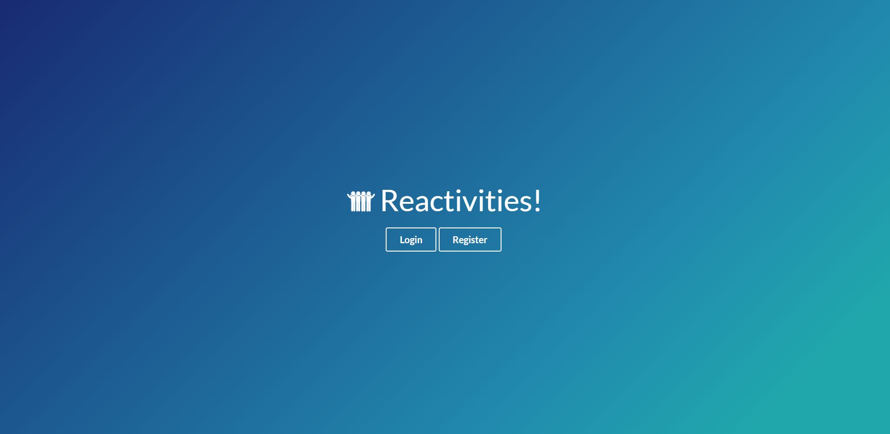
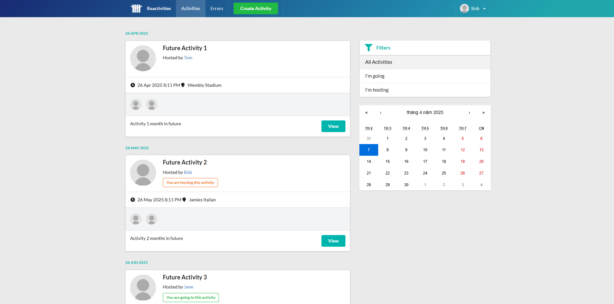
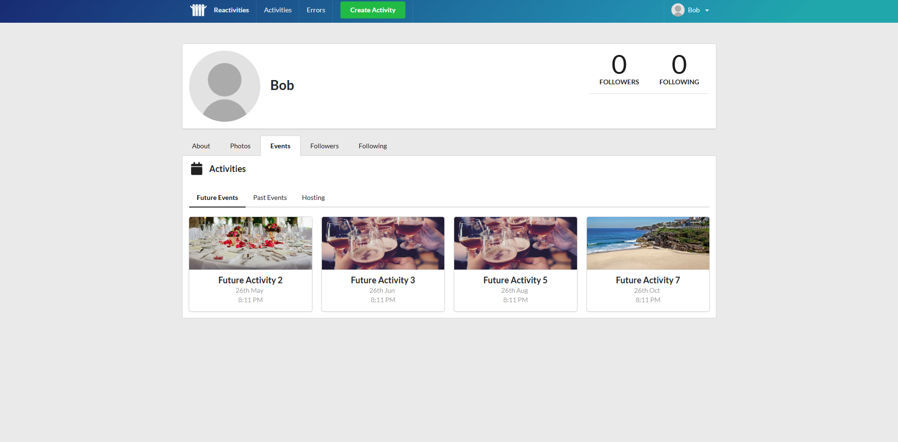
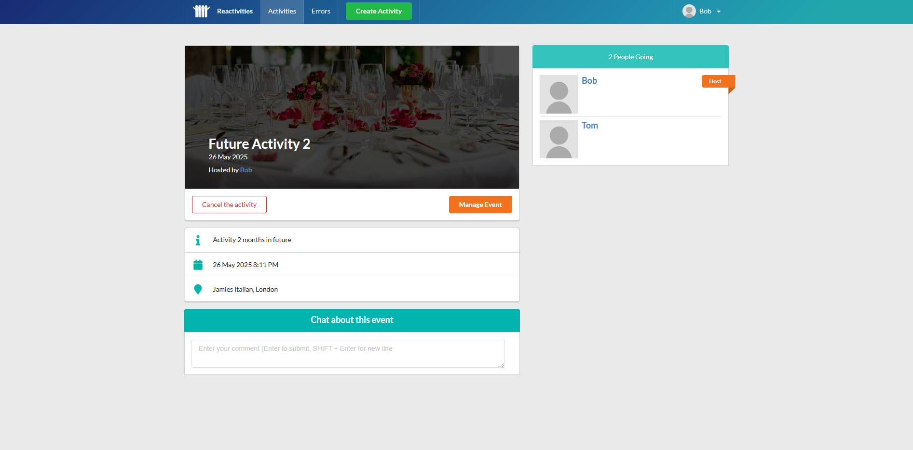

# ⚠️ Project Status: Updating ⚠️

This project is currently undergoing updates and improvements. During this time, some features may not work as expected, and the documentation may not reflect the latest changes.

[See the application](react-fullstack-project.azurewebsites.net)
Test account: bob@test.com - Pa$$w0rd

# Reactivities

## Description

This is a full-stack project: Reactivities. The application is built with React, TypeScript, C#, ASP.NET Core. The social media is for
listing users' activities, Users can register the activity and also posting their activity event for
others to join.

### To run the server

`dotnet run --no-hot-reload`

`dotnet watch run`

### To run the client

`npm run dev`

### Picture Demos

